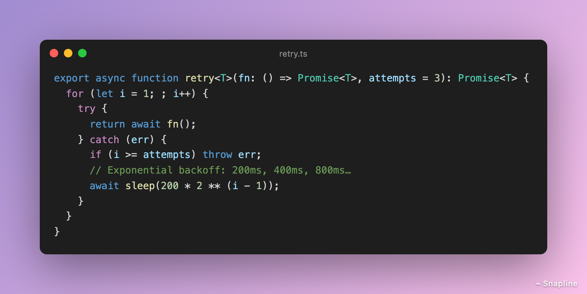
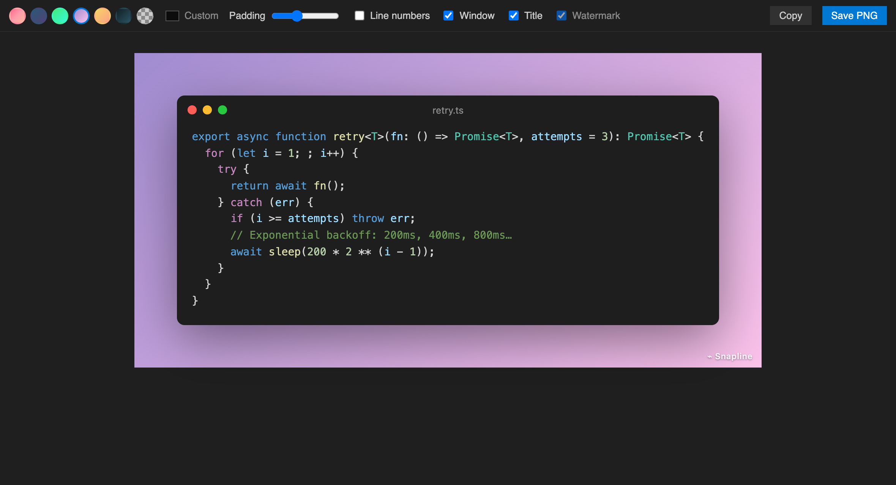

# Snapline — Code Screenshots

**Turn code into beautiful, shareable images in one click.** Select code, press <kbd>⌘⌥S</kbd> / <kbd>Ctrl+Alt+S</kbd>, and get a polished snapshot in your editor's own theme — ready for Twitter/X, LinkedIn, docs, slides or a PR.

A fast, **actively maintained** alternative to CodeSnap and Polacode.

## Features

- **Your exact theme** — colors come straight from your editor, so the image matches what you see.
- **One click** — select code → *Snapline: Snap Code* (context menu, editor title button, or <kbd>⌘⌥S</kbd>). No selection snaps the whole file.
- **Beautiful by default** — gradient backgrounds, window controls, file title, soft shadow, adjustable padding.
- **Line numbers** that start at the real line number.
- **Smart dedent** — nested code is shifted to the left edge automatically.
- **Save PNG** (2× resolution) or **copy** the image straight to your clipboard.
- **Doesn't clobber your clipboard** — whatever you had copied is restored after a snap.
- Settings are remembered between snaps.

## Snapline Pro

**Try it free:** every Pro feature is unlocked for your first 7 days — no signup, no card. After that, keep them with a one-time license.

Free snaps include a small *Snapline* credit in the corner. **Pro** — part of the one-time **Branchline Pro** license, no subscription — adds:

- **No watermark**
- **Custom background colors**
- Pro features in [Branchline — Git Graph](https://marketplace.visualstudio.com/items?itemName=branchline.branchline) and [TODO Lens](https://marketplace.visualstudio.com/items?itemName=branchline.todo-lens) too

Run **`Snapline: Get Snapline Pro`**, then **`Snapline: Enter Pro License Key`**.

## Also by the author

- **[Branchline — Git Graph](https://marketplace.visualstudio.com/items?itemName=branchline.branchline)** — a fast, maintained Git Graph.
- **[TODO Lens — Better Comments & TODO Tree](https://marketplace.visualstudio.com/items?itemName=branchline.todo-lens)** — color-coded comments and every TODO in one tree.
- **[Docline — Instant Python Docstrings](https://marketplace.visualstudio.com/items?itemName=branchline.docline-python-docstring-generator)** — type `"""` and get Google/NumPy/Sphinx docstrings.

## Support

Free and maintained by one developer. If it saves you time, you can [chip in from $1](https://dealership6.gumroad.com/l/support).

## Feedback

Bugs and ideas: [GitHub issues](https://github.com/kfirs97/snapline/issues).

## License

Source-available under the [Snapline License](LICENSE): free to use, read and learn from; redistribution and derivative publications are not permitted.
